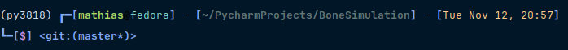

# HLRS-Projekt

## Einrichtung der Arbeitsumgebung unter Windows

---

### 1. Installation von Entwicklungswerkzeugen

#### Visual Studio Code

- [Download Visual Studio Code](https://code.visualstudio.com/docs/setup/windows)
- Folgt den Anweisungen auf der Webseite für die Installation.

#### PrePoMax (FEM-Softwarepaket)

- Die `.zip`-Datei zur Installation ist im Projektordner verfügbar.
- [Download PrePoMax](https://prepomax.fs.um.si/) - hier finden ihr die Installationsanleitung.

#### Alternative für Linux: CalculiX

- [Download CalculiX](https://www.dhondt.de/) - Anweisungen zur Installation auf der Webseite.

#### ParaView (Wissenschaftliche Visualisierungen)

- [Download ParaView](https://www.paraview.org/download/) - folgt den Anweisungen auf der Webseite.

#### Python und Anaconda

- [Installation von Python und Anaconda](https://www.elab2go.de/demo-py1/installation-python-anaconda.php)
- Folgt den Anweisungen auf der Webseite. Bei Fragen oder Problemen könnt ihr mich einfach anschreiben!

---

## 2. Einrichtung der Python-Umgebung

Diese Anleitung führt durch die Erstellung und Aktivierung einer Conda-Umgebung sowie die Installation der benötigten Pakete.

### 2.1 Conda-Umgebung erstellen

Öffnet das Anaconda Prompt (auf Windows empfohlen) und führt den folgenden Befehl aus, um eine neue Umgebung namens `py3818` mit Python 3.12.7 zu erstellen:

```bash
conda create --name py3818 python=3.12.7
```

### 2.2 Conda-Umgebung aktivieren

Um die Umgebung zu aktivieren, verwendet:

```bash
conda activate py3818
```

> **Hinweis**: Nach Aktivierung der Umgebung sollte `(py3818)` links im Prompt angezeigt werden.

##### sollte dann etwa so aussehen: 

---

## 3. Installation der Pakete mit environment.yml und requirements.txt

### Installation mit `environment.yml`

Falls ihr die `environment.yml` verwenden möchtet, könnt Ihr die Umgebung mit allen Paketen erstellen, indem ihr den folgenden Befehl ausführen:

```bash
conda env create -f environment.yml
```

Die Datei `environment.yml` installiert alle erforderlichen Pakete und Abhängigkeiten automatisch.
Zusätzlich benötigt ihr aber noch folgenden Part:

### Installation mit `requirements.txt`

Alternativ können Sie die `requirements.txt` verwenden:

```bash
pip install -r requirements.txt
```

> **Hinweis**: Verwenden Sie diese Methode, wenn Sie zusätzliche Pakete via pip installieren müssen, die nicht in `environment.yml` enthalten sind.

---

## 4. Manuelle Installation der notwendigen Pakete

Falls Sie die Pakete manuell installieren möchten, verwenden Sie die folgende Liste von Befehlen, sobald die Umgebung aktiviert ist.

### 4.1 Installation von Conda-Paketen

```bash
conda install -c conda-forge numpy
conda install -c conda-forge scipy
conda install -c conda-forge scikit-image
conda install -c conda-forge pypng
conda install -c conda-forge tqdm
conda install -c conda-forge matplotlib
conda install -c conda-forge tifffile
conda install -c conda-forge itk
conda install -c conda-forge vtk
conda install -c conda-forge ccx2paraview
conda install -c conda-forge meshio=5.0.0
conda install -c conda-forge pygalmesh
conda install -c conda-forge dxchange
```

### Zusätzliche Pakete mit pip installieren

Manche Pakete sind möglicherweise nicht in Conda verfügbar. Installiere sie mit pip:

```bash
pip install ciclope[all]
pip install PyMCubes
```

> **Hinweis**: Wenn pip-Pakete wie ciclope oder PyMCubes nicht kompatibel sind, versuche, pip-Pakete immer nach der Installation der Conda-Pakete zu installieren, um Abhängigkeitskonflikte zu vermeiden.

---

## Automatisierte Installation für Windows mit `.bat`-Datei

Es gibt eine `.bat`-Datei im Projektordner, die alle Schritte automatisiert (hoffe ich zumindest). Einfach die Datei ausführen, um die Umgebung und alle Pakete zu installieren.

> **Hinweis**: Bei Problemen während der Installation stehe ich gerne zur Verfügung!
